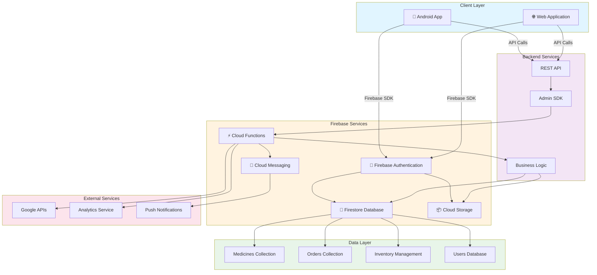

# Al-Fawaz Warehouse - Architecture Overview

This document outlines the system architecture for the Al-Fawaz Medicines Warehouse application.

## System Architecture

## Component Description

### Client Layer
- **Android App**: Native Android application for warehouse management and medicine distribution
- **Web Application**: Browser-based interface for administration and monitoring

### Firebase Services
- **Authentication**: Secure user login and session management
- **Firestore**: Real-time NoSQL database for medicines, orders, and inventory
- **Cloud Storage**: Image and document storage for medicine information
- **Cloud Functions**: Serverless backend logic and API endpoints
- **Cloud Messaging**: Push notifications for order updates and alerts

### Backend Services
- **REST API**: RESTful endpoints for client applications
- **Admin SDK**: Firebase Admin SDK for server-side operations
- **Business Logic**: Core application logic including order processing and inventory management

### Data Layer
- **Medicines Collection**: Product catalog with details and pricing
- **Orders Collection**: Customer orders and transaction history
- **Inventory Management**: Stock levels and warehouse management
- **Users Database**: User profiles and permissions

### External Services
- **Google APIs**: Integration with Google services
- **Analytics**: Event tracking and usage analytics
- **Push Notifications**: External notification delivery service

## Key Features

- 🏥 **Medicine Inventory Management**: Track medicines from brands like Domina, Medicco, Al-Mutahida, Ibn Rushd, Lama, Happy Cure, and Celia
- 📦 **Order Processing**: Handle customer orders with real-time updates
- 🔒 **Secure Authentication**: Firebase-based user authentication
- 📱 **Cross-Platform**: Support for Android and web clients
- 🔔 **Real-time Notifications**: Push notifications for order updates
- 📊 **Analytics & Reporting**: Track warehouse metrics and business analytics

## Deployment

The application is deployed on Google Firebase infrastructure, leveraging:
- Firestore for real-time database
- Cloud Functions for backend logic
- Cloud Storage for assets
- Firebase Authentication for security
